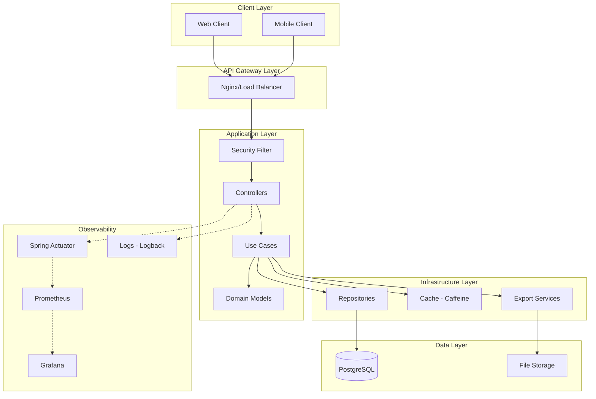
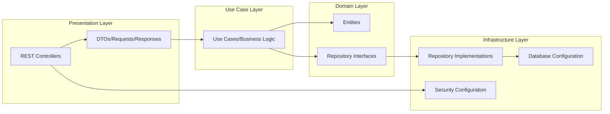
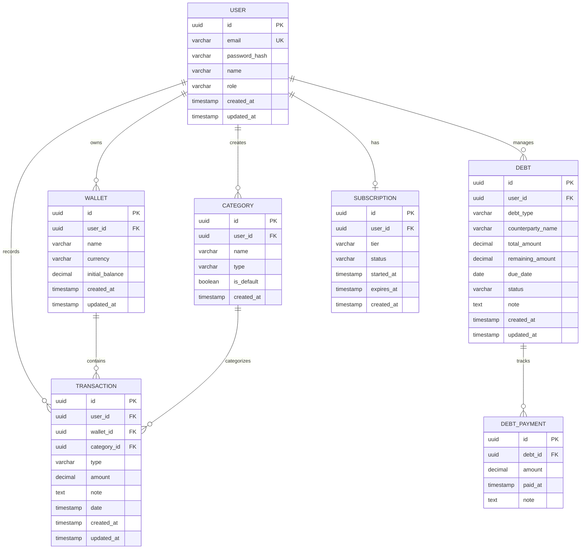
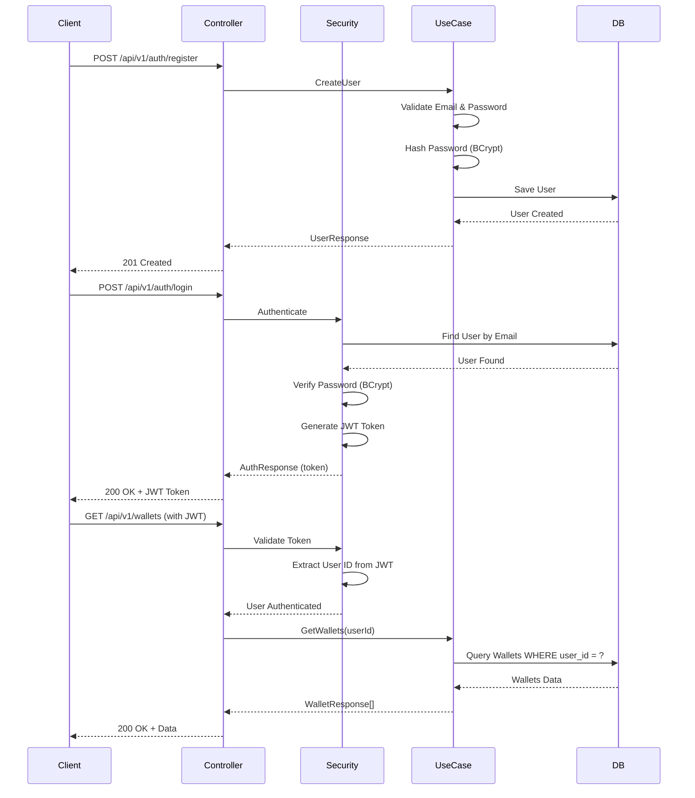
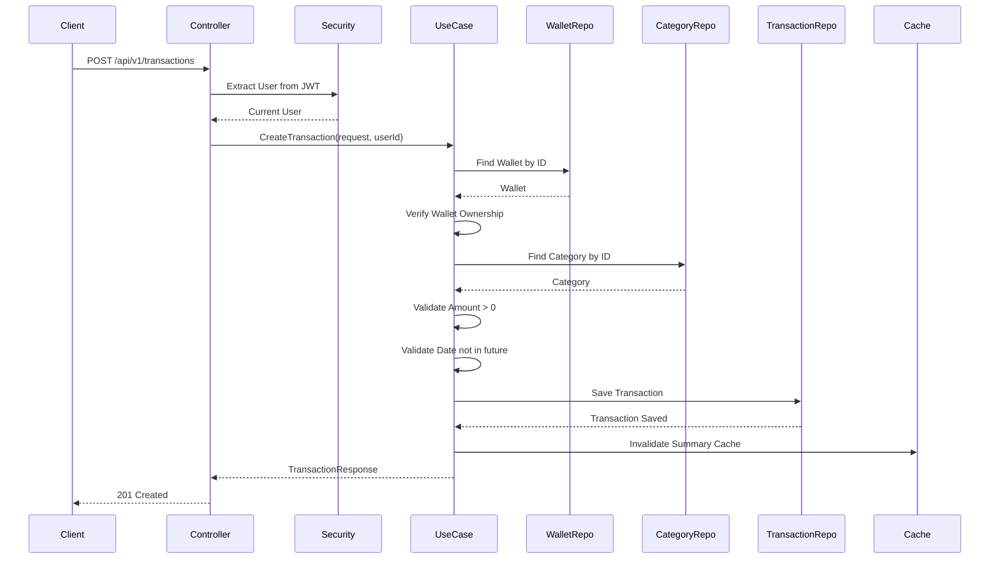
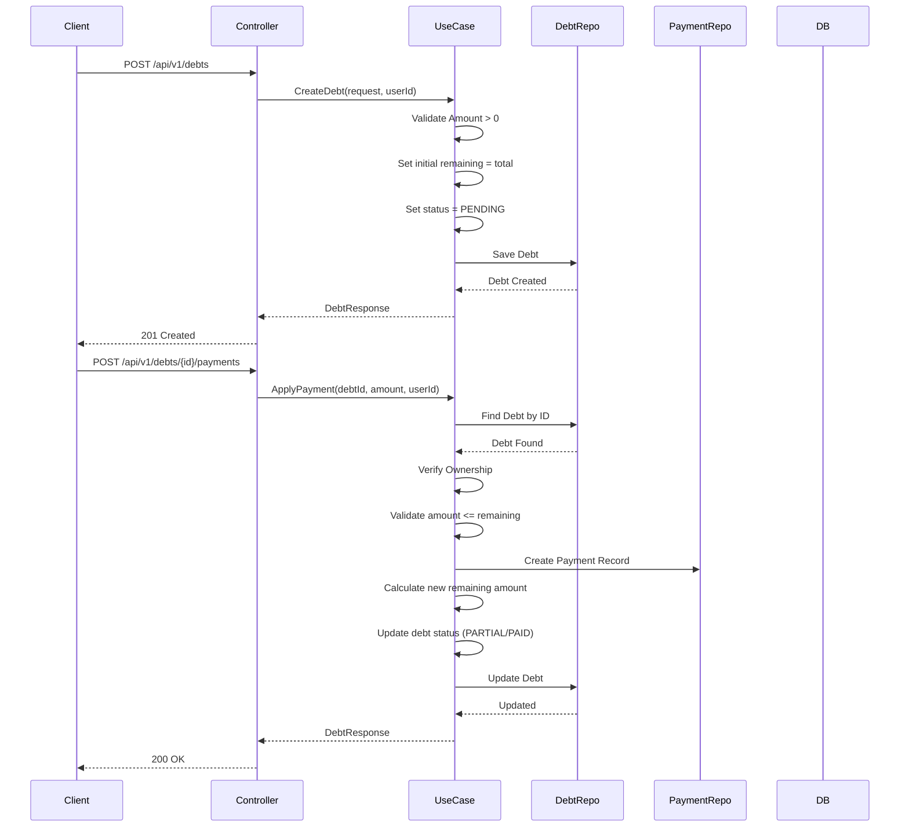
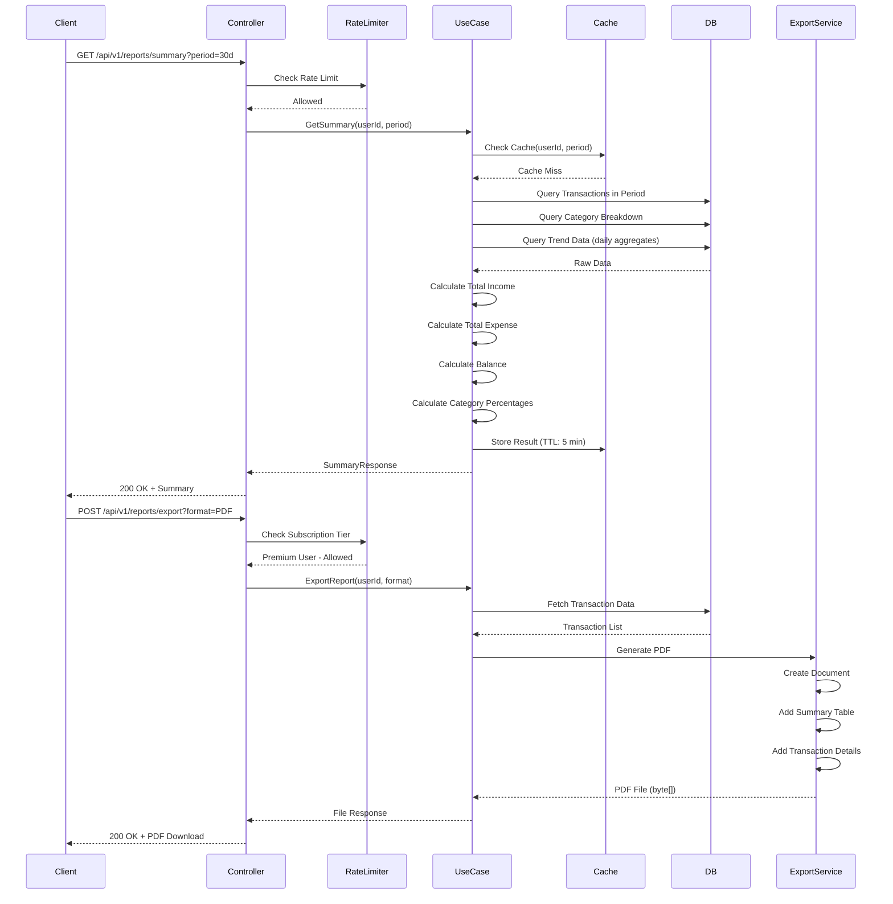
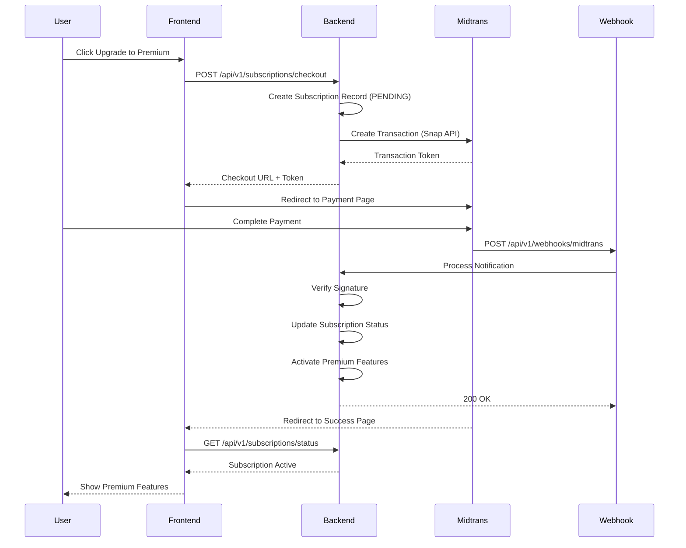

# Expense Tracker - UMKM Friendly

A simple financial tracking application for individuals and SMEs with debt management, financial reports, and data export features.

[](https://openjdk.org/)
[](https://spring.io/projects/spring-boot)
[](https://www.postgresql.org/)
[](https://openjdk.org/jeps/444)
[](LICENSE)

## Table of Contents

- [Overview](#overview)
- [Features](#features)
- [Tech Stack](#tech-stack)
- [Architecture](#architecture)
- [Database Schema](#database-schema)
- [API Flow](#api-flow)
- [Getting Started](#getting-started)
- [Configuration](#configuration)
- [Database Migration](#database-migration)
- [Running the Application](#running-the-application)
- [API Documentation](#api-documentation)
- [Monitoring & Observability](#monitoring--observability)
- [Testing](#testing)
- [Deployment](#deployment)
- [Security](#security)
- [Contributing](#contributing)
- [Roadmap](#roadmap)

## Overview

Expense Tracker is a Spring Boot-based application designed to help SMEs and individuals manage their finances easily. The application supports transaction recording, debt/receivables management, financial reports, and data export in various formats.

### Target Users

- **Warung Owners**: Quickly record income/expenses and customer debts
- **SME Owners**: Manage business finances with comprehensive reports
- **Freelancers/Employees**: Easily track personal expenses

## Features

### Core Features (Free Tier)

- **Authentication & Authorization**
  - JWT-based authentication
  - Role-based access control
  - Secure password hashing with BCrypt

- **Transaction Management**
  - Create, read, update, delete transactions
  - Support for income and expense types
  - Category-based organization
  - Multi-wallet support
  - Advanced filtering and search by date, type, category, and amount range

- **Debt Management**
  - Track receivables (piutang) and payables (hutang)
  - Support for partial payments
  - Automatic status tracking (PENDING, PARTIAL, PAID)
  - Due date monitoring
  - Payment history tracking

- **Dashboard & Reports**
  - Real-time financial summary
  - Income vs Expense analysis
  - Category breakdown with percentages
  - Trend analysis with daily data points
  - Custom date range reports
  - Monthly/weekly/yearly aggregations

- **Export Functionality**
  - CSV export (limited for free tier)
  - Excel export (XLSX format)
  - PDF reports with charts

### Premium Features

- Cloud sync & auto backup
- Unlimited categories and wallets
- Advanced reports (multi-month, trend analysis, forecasting)
- Export without watermark
- Automated payment reminders
- Priority support
- Subscription payment via Midtrans

## Tech Stack

### Backend

- **Java 25 LTS** - Latest Long-Term Support version with modern features
  - **Virtual Threads** (JEP 444) - Lightweight concurrency for high-performance I/O operations
  - **ScopedValue API** (JEP 464) - Modern alternative to ThreadLocal for efficient context propagation
  - **Gradle 9.2.1** - Latest build tool with full Java 25 support
- **Spring Boot 3.5.7** - Application framework
  - Spring Data JPA - Database access layer
  - Spring Security - Authentication & authorization
  - Spring Validation - Input validation
  - Spring Actuator - Health checks and metrics
  - Spring Cache - Caching abstraction
  - Spring AOP - Cross-cutting concerns
- **PostgreSQL 15** - Primary relational database
- **Flyway 9.22** - Database version control and migrations
- **JWT (jjwt 0.11.5)** - Token-based authentication
- **Lombok** - Reduce boilerplate code
- **OpenAPI 3 / Swagger** - API documentation
- **Micrometer + Prometheus** - Metrics collection and monitoring
- **Logstash Logback Encoder** - Structured logging in JSON format

### Libraries & Tools

- **OpenCSV 5.9** - CSV file generation and parsing
- **Apache POI 5.2.5** - Excel (XLSX) file generation
- **OpenPDF 2.0.2** - PDF generation (LGPL license)
- **Caffeine** - High-performance in-memory caching
- **JUnit 5** - Unit and integration testing

### Future Integrations

- **Midtrans** - Payment gateway for subscription management
- **Redis** - Distributed caching (optional)
- **RabbitMQ/Kafka** - Event streaming (optional)

## Architecture

### High-Level Architecture



### Clean Architecture Pattern

This application follows Clean Architecture principles with clear separation of concerns:



**Layer Responsibilities:**

- **Presentation Layer**: HTTP endpoints, request/response mapping, validation
- **Use Case Layer**: Business logic, orchestration, validation rules
- **Domain Layer**: Core business entities, repository contracts
- **Infrastructure Layer**: Database access, external services, framework configuration

## Database Schema

### Entity Relationship Diagram



### Key Tables

#### Users
Stores user authentication credentials and profile information. Passwords are hashed using BCrypt.

#### Wallets
Enables multi-wallet support for organizing finances across different accounts (e.g., Cash, Bank Account, E-wallet, Credit Card).

#### Categories
User-defined or system-default categories for transaction classification (e.g., Food, Transport, Salary, Business).

#### Transactions
Core table storing all financial transactions with support for income and expense types.

#### Debts
Tracks money owed to the user (receivables/piutang) or by the user (payables/hutang).

#### Debt Payments
Records all payments made toward debts, supporting partial and full payments.

#### Subscriptions
Manages user subscription tiers (FREE, PREMIUM) and payment status.

## API Flow

### Authentication Flow



### Transaction Creation Flow



### Debt Management Flow



### Report Generation Flow



### Payment Gateway Flow (Midtrans - Upcoming)



## Getting Started

### Prerequisites

- **Java 25 LTS** or later ([Download](https://adoptium.net/))
  - Earlier versions (Java 21, 23) will also work but won't have virtual threads or ScopedValue optimizations
- **PostgreSQL 14+** ([Download](https://www.postgresql.org/download/))
- **Gradle 9.x** (included via wrapper - automatic download)
- **Docker & Docker Compose** (optional, for containerized setup)

### Local Development Setup

1. **Clone the repository**
   ```bash
   git clone <repository-url>
   cd expense-tracker
   ```

2. **Setup PostgreSQL Database**

   **Option A: Using Docker (Recommended)**
   ```bash
   docker run --name expense-tracker-db \
     -e POSTGRES_DB=expense_tracker \
     -e POSTGRES_USER=expenseuser \
     -e POSTGRES_PASSWORD=expensepass \
     -e TZ=Asia/Jakarta \
     -p 5432:5432 \
     -d postgres:15-alpine
   ```

   **Option B: Local PostgreSQL Installation**
   ```bash
   # Create database
   createdb expense_tracker

   # Or using psql
   psql -U postgres
   CREATE DATABASE expense_tracker;
   CREATE USER expenseuser WITH PASSWORD 'expensepass';
   GRANT ALL PRIVILEGES ON DATABASE expense_tracker TO expenseuser;
   ```

3. **Configure Application**

   Create `src/main/resources/application-local.yaml`:
   ```yaml
   spring:
     datasource:
       url: jdbc:postgresql://localhost:5432/expense_tracker?timezone=Asia/Jakarta
       username: expenseuser
       password: expensepass

   jwt:
     secret: your-super-secret-key-min-256-bits-change-this-in-production

   logging:
     level:
       com.fajars.expensetracker: DEBUG
   ```

4. **Run Database Migrations**
   ```bash
   ./gradlew flywayMigrate
   ```

5. **Build the Application**
   ```bash
   ./gradlew clean build
   ```

6. **Run the Application**
   ```bash
   ./gradlew bootRun --args='--spring.profiles.active=local'
   ```

   Or using the JAR:
   ```bash
   java -jar build/libs/expense-tracker-0.0.1-SNAPSHOT.jar
   ```

7. **Verify Application is Running**

   Check health endpoint:
   ```bash
   curl http://localhost:8081/api/v1/actuator/health
   ```

   Expected response:
   ```json
   {"status":"UP"}
   ```

8. **Access the Application**
   - API Base URL: `http://localhost:8081/api/v1`
   - Swagger UI: `http://localhost:8081/api/v1/swagger-ui.html`
   - Actuator Health: `http://localhost:8081/api/v1/actuator/health`
   - Prometheus Metrics: `http://localhost:8081/api/v1/actuator/prometheus`

## Configuration

### Environment Variables

| Variable | Description | Default | Required |
|----------|-------------|---------|----------|
| `SPRING_DATASOURCE_URL` | PostgreSQL JDBC connection URL | - | Yes |
| `SPRING_DATASOURCE_USERNAME` | Database username | - | Yes |
| `SPRING_DATASOURCE_PASSWORD` | Database password | - | Yes |
| `JWT_SECRET` | Secret key for JWT token signing (min 256 bits) | - | Yes |
| `SPRING_PROFILES_ACTIVE` | Active Spring profile (dev/prod) | dev | No |
| `SERVER_PORT` | Application HTTP port | 8081 | No |
| `MIDTRANS_SERVER_KEY` | Midtrans server key (upcoming) | - | No |
| `MIDTRANS_CLIENT_KEY` | Midtrans client key (upcoming) | - | No |

### Application Profiles

- **dev**: Development profile with debug logging and relaxed security
- **local**: Local development with custom database settings
- **prod**: Production profile with optimized settings and strict security

### JWT Configuration

The JWT secret must be a strong, random key (minimum 256 bits).

**Generate a secure secret key:**
```bash
# Using OpenSSL (Recommended)
openssl rand -base64 32

# Using Python
python3 -c "import secrets; print(secrets.token_urlsafe(32))"

# Using Node.js
node -e "console.log(require('crypto').randomBytes(32).toString('base64'))"
```

**Update configuration:**
```yaml
jwt:
  secret: <your-generated-key-here>
```

### CORS Configuration

For frontend integration, configure CORS in `SecurityConfig.java`:

```java
@Bean
public CorsConfigurationSource corsConfigurationSource() {
    CorsConfiguration configuration = new CorsConfiguration();
    configuration.setAllowedOrigins(Arrays.asList("http://localhost:3000"));
    configuration.setAllowedMethods(Arrays.asList("GET", "POST", "PUT", "DELETE"));
    configuration.setAllowedHeaders(Arrays.asList("*"));
    configuration.setAllowCredentials(true);
    // ...
}
```

## Database Migration

### Flyway Migrations

Database schema is version-controlled using Flyway migrations located in `src/main/resources/db/migration/`:

- **V1__init.sql** - Initial schema (users, wallets, categories, transactions, debts, subscriptions)
- **V2__add_debt_type_and_note.sql** - Add debt type enum and notes field
- **V3__add_reporting_indexes.sql** - Performance indexes for reporting queries

### Running Migrations

```bash
# Run all pending migrations
./gradlew flywayMigrate

# Get migration status and info
./gradlew flywayInfo

# Validate applied migrations against available scripts
./gradlew flywayValidate

# Repair migration history (if needed)
./gradlew flywayRepair

# Clean database (CAUTION: deletes all data)
./gradlew flywayClean
```

### Creating New Migrations

**Naming Convention:**
```
V{version}__{description}.sql
```

**Example:**
```bash
# Create new migration file
touch src/main/resources/db/migration/V4__add_budget_tracking.sql
```

**Migration Best Practices:**
- Always use sequential version numbers
- Write idempotent migrations when possible
- Test migrations on a copy of production data
- Never modify applied migrations
- Include rollback plan in comments

## Running the Application

### Development Mode

```bash
# Using Gradle wrapper (recommended)
./gradlew bootRun

# With specific profile
./gradlew bootRun --args='--spring.profiles.active=dev'

# With custom port
./gradlew bootRun --args='--server.port=9090'

# With debug logging
./gradlew bootRun --args='--logging.level.com.fajars.expensetracker=DEBUG'
```

### Production Mode

```bash
# Build production JAR
./gradlew clean bootJar

# Run with production profile
java -jar build/libs/expense-tracker-0.0.1-SNAPSHOT.jar \
  --spring.profiles.active=prod \
  -Dserver.port=8081

# With external configuration
java -jar build/libs/expense-tracker-0.0.1-SNAPSHOT.jar \
  --spring.config.location=file:/etc/expense-tracker/application.yaml
```

### Docker Deployment

**Build Docker image:**
```bash
docker build -t expense-tracker:latest .
```

**Run container:**
```bash
docker run -d \
  --name expense-tracker \
  -p 8081:8081 \
  -e SPRING_DATASOURCE_URL=jdbc:postgresql://db-host:5432/expense_tracker \
  -e SPRING_DATASOURCE_USERNAME=dbuser \
  -e SPRING_DATASOURCE_PASSWORD=dbpass \
  -e JWT_SECRET=your-secret-key \
  -e SPRING_PROFILES_ACTIVE=prod \
  expense-tracker:latest
```

### Docker Compose (Full Stack)

```bash
# Start all services (app + database + monitoring)
docker-compose up -d

# View logs
docker-compose logs -f app

# Stop services
docker-compose down

# Stop and remove volumes (data will be lost)
docker-compose down -v

# Restart specific service
docker-compose restart app
```

Services included in docker-compose:
- **app**: Spring Boot application (port 8081)
- **db**: PostgreSQL database (port 5432)
- **prometheus**: Metrics collector (port 9090)
- **grafana**: Monitoring dashboard (port 3000)

## API Documentation

### Interactive API Documentation

The application uses OpenAPI 3.0 (Swagger) for interactive API documentation.

**Access Swagger UI:**
```
http://localhost:8081/api/v1/swagger-ui.html
```

**OpenAPI JSON specification:**
```
http://localhost:8081/api/v1/v3/api-docs
```

### Core Endpoints

#### Authentication

| Method | Endpoint | Description | Auth Required |
|--------|----------|-------------|---------------|
| POST | `/auth/register` | Register new user account | No |
| POST | `/auth/login` | Login and receive JWT token | No |

#### Users

| Method | Endpoint | Description | Auth Required |
|--------|----------|-------------|---------------|
| GET | `/users/me` | Get current user profile | Yes |
| PUT | `/users/me` | Update user profile | Yes |

#### Wallets

| Method | Endpoint | Description | Auth Required |
|--------|----------|-------------|---------------|
| GET | `/wallets` | List all user wallets | Yes |
| POST | `/wallets` | Create new wallet | Yes |
| GET | `/wallets/{id}` | Get wallet details | Yes |
| PUT | `/wallets/{id}` | Update wallet | Yes |
| DELETE | `/wallets/{id}` | Delete wallet | Yes |

#### Categories

| Method | Endpoint | Description | Auth Required |
|--------|----------|-------------|---------------|
| GET | `/categories` | List all categories | Yes |
| POST | `/categories` | Create new category | Yes |
| GET | `/categories/{id}` | Get category details | Yes |
| PUT | `/categories/{id}` | Update category | Yes |
| DELETE | `/categories/{id}` | Delete category | Yes |

#### Transactions

| Method | Endpoint | Description | Auth Required |
|--------|----------|-------------|---------------|
| GET | `/transactions` | List transactions with filters | Yes |
| POST | `/transactions` | Create new transaction | Yes |
| GET | `/transactions/{id}` | Get transaction details | Yes |
| PUT | `/transactions/{id}` | Update transaction | Yes |
| DELETE | `/transactions/{id}` | Delete transaction | Yes |

**Query Parameters for filtering:**
- `walletId` - Filter by wallet
- `categoryId` - Filter by category
- `type` - Filter by type (INCOME/EXPENSE)
- `startDate` - Start date (ISO 8601)
- `endDate` - End date (ISO 8601)
- `minAmount` - Minimum amount
- `maxAmount` - Maximum amount

#### Debts

| Method | Endpoint | Description | Auth Required |
|--------|----------|-------------|---------------|
| GET | `/debts` | List all debts | Yes |
| POST | `/debts` | Create new debt | Yes |
| GET | `/debts/{id}` | Get debt details | Yes |
| PUT | `/debts/{id}` | Update debt | Yes |
| POST | `/debts/{id}/payments` | Add payment to debt | Yes |
| PUT | `/debts/{id}/mark-paid` | Mark debt as fully paid | Yes |
| DELETE | `/debts/{id}` | Delete debt | Yes |

#### Reports

| Method | Endpoint | Description | Auth Required |
|--------|----------|-------------|---------------|
| GET | `/reports/summary` | Get financial summary | Yes |
| GET | `/reports/category-breakdown` | Category-wise breakdown | Yes |
| GET | `/reports/trend` | Trend analysis data | Yes |
| POST | `/reports/export` | Export data (CSV/Excel/PDF) | Yes |

#### Dashboard

| Method | Endpoint | Description | Auth Required |
|--------|----------|-------------|---------------|
| GET | `/dashboard` | Get dashboard summary | Yes |

#### Subscriptions (Upcoming)

| Method | Endpoint | Description | Auth Required |
|--------|----------|-------------|---------------|
| GET | `/subscriptions/status` | Get current subscription | Yes |
| POST | `/subscriptions/checkout` | Initiate premium upgrade | Yes |
| POST | `/webhooks/midtrans` | Midtrans payment webhook | No |

### Authentication

All endpoints (except `/auth/*` and webhooks) require JWT authentication.

**Include the token in the Authorization header:**
```
Authorization: Bearer <your-jwt-token>
```

### Example API Calls

#### Register New User
```bash
curl -X POST http://localhost:8081/api/v1/auth/register \
  -H "Content-Type: application/json" \
  -d '{
    "email": "user@example.com",
    "password": "SecurePass123!",
    "name": "John Doe"
  }'
```

**Response:**
```json
{
  "id": "123e4567-e89b-12d3-a456-426614174000",
  "email": "user@example.com",
  "name": "John Doe",
  "role": "USER",
  "createdAt": "2024-12-06T10:30:00"
}
```

#### Login
```bash
curl -X POST http://localhost:8081/api/v1/auth/login \
  -H "Content-Type: application/json" \
  -d '{
    "email": "user@example.com",
    "password": "SecurePass123!"
  }'
```

**Response:**
```json
{
  "token": "eyJhbGciOiJIUzI1NiIsInR5cCI6IkpXVCJ9...",
  "type": "Bearer",
  "expiresIn": 86400
}
```

#### Create Wallet
```bash
curl -X POST http://localhost:8081/api/v1/wallets \
  -H "Authorization: Bearer <token>" \
  -H "Content-Type: application/json" \
  -d '{
    "name": "Cash Wallet",
    "currency": "IDR",
    "initialBalance": 1000000
  }'
```

#### Create Transaction
```bash
curl -X POST http://localhost:8081/api/v1/transactions \
  -H "Authorization: Bearer <token>" \
  -H "Content-Type: application/json" \
  -d '{
    "walletId": "wallet-uuid",
    "categoryId": "category-uuid",
    "type": "EXPENSE",
    "amount": 50000,
    "note": "Lunch at warung",
    "date": "2024-12-06T12:30:00"
  }'
```

#### Get Financial Summary
```bash
curl -X GET "http://localhost:8081/api/v1/reports/summary?startDate=2024-12-01&endDate=2024-12-31" \
  -H "Authorization: Bearer <token>"
```

**Response:**
```json
{
  "totalIncome": 5000000,
  "totalExpense": 3500000,
  "balance": 1500000,
  "categoryBreakdown": [
    {
      "categoryName": "Food",
      "amount": 1200000,
      "percentage": 34.3
    }
  ],
  "trendData": [
    {
      "date": "2024-12-01",
      "income": 200000,
      "expense": 150000
    }
  ]
}
```

#### Export to PDF
```bash
curl -X POST "http://localhost:8081/api/v1/reports/export?format=PDF&startDate=2024-12-01&endDate=2024-12-31" \
  -H "Authorization: Bearer <token>" \
  --output report.pdf
```

## Monitoring & Observability

### Spring Boot Actuator

The application exposes health and metrics endpoints via Spring Boot Actuator.

**Health check:**
```bash
curl http://localhost:8081/api/v1/actuator/health
```

**Detailed health (requires authentication):**
```bash
curl http://localhost:8081/api/v1/actuator/health \
  -H "Authorization: Bearer <token>"
```

**Available metrics:**
```bash
curl http://localhost:8081/api/v1/actuator/metrics
```

**Specific metric:**
```bash
curl http://localhost:8081/api/v1/actuator/metrics/jvm.memory.used
```

### Available Actuator Endpoints

- `/actuator/health` - Application health status
- `/actuator/info` - Application build information
- `/actuator/metrics` - Available metrics list
- `/actuator/metrics/{metric}` - Specific metric value
- `/actuator/prometheus` - Prometheus-formatted metrics

### Prometheus Integration

Prometheus can scrape metrics from the `/actuator/prometheus` endpoint.

**Example `prometheus.yml` configuration:**
```yaml
scrape_configs:
  - job_name: 'expense-tracker'
    metrics_path: '/api/v1/actuator/prometheus'
    static_configs:
      - targets: ['localhost:8081']
    scrape_interval: 15s
```

### Grafana Dashboards

**Recommended dashboards:**
- **Spring Boot 2.1 System Monitor** (Dashboard ID: 11378)
- **JVM (Micrometer)** (Dashboard ID: 4701)
- **Spring Boot Statistics** (Dashboard ID: 12900)

**Import dashboard:**
1. Access Grafana at `http://localhost:3000`
2. Navigate to Dashboards > Import
3. Enter dashboard ID
4. Select Prometheus datasource
5. Click Import

### Application Metrics

The application tracks the following custom metrics:

- **Transaction metrics:**
  - `transactions.created.total` - Total transactions created
  - `transactions.deleted.total` - Total transactions deleted
  - `transactions.amount.sum` - Sum of transaction amounts

- **Debt metrics:**
  - `debts.created.total` - Total debts created
  - `debts.payments.total` - Total debt payments
  - `debts.paid.total` - Total fully paid debts

- **Export metrics:**
  - `reports.export.total` - Total reports exported
  - `reports.export.duration` - Export operation duration

### Logging

Application logs are structured using Logstash Logback Encoder for easy parsing and indexing.

**Log levels:**
- `ERROR` - Exceptions and critical errors
- `WARN` - Warning conditions
- `INFO` - Normal operations and important events
- `DEBUG` - Detailed flow (development only)

**View logs:**
```bash
# Docker Compose
docker-compose logs -f app

# Local development
tail -f logs/application.log

# Filter for errors only
grep "ERROR" logs/application.log
```

**Log format (JSON):**
```json
{
  "timestamp": "2024-12-06T10:30:00.123+07:00",
  "level": "INFO",
  "thread": "http-nio-8081-exec-1",
  "logger": "com.fajars.expensetracker.transaction.TransactionController",
  "message": "Transaction created",
  "userId": "user-uuid",
  "transactionId": "transaction-uuid"
}
```

### Monitoring Stack with Docker Compose

The provided `docker-compose.yml` includes:
- **Prometheus** - Metrics collection and storage (port 9090)
- **Grafana** - Visualization and dashboards (port 3000)
- **Loki** - Log aggregation (port 3100) [optional]

**Access monitoring tools:**
- Prometheus: `http://localhost:9090`
- Grafana: `http://localhost:3000` (default: admin/admin)

## Testing

### Run All Tests

```bash
./gradlew test
```

### Run Specific Test Class

```bash
./gradlew test --tests TransactionControllerTest
```

### Run Tests with Code Coverage

```bash
./gradlew test jacocoTestReport
```

Coverage report: `build/reports/jacoco/test/html/index.html`

### Run Integration Tests Only

```bash
./gradlew integrationTest
```

### Test Categories

- **Unit Tests**: Test individual components in isolation
  - Service layer tests
  - Use case tests
  - Utility tests

- **Integration Tests**: Test component interactions
  - Controller integration tests
  - Repository tests with real database (H2)
  - Security integration tests

- **Security Tests**: Test authentication and authorization
  - JWT token validation
  - Role-based access control
  - Input validation

### Test Best Practices

- Write tests for all business logic
- Use meaningful test names
- Follow AAA pattern (Arrange, Act, Assert)
- Mock external dependencies
- Use test fixtures for common data
- Maintain test data isolation

## Deployment

### Production Checklist

Before deploying to production, ensure:

- [ ] Change JWT secret to a cryptographically secure random value
- [ ] Use production database with automated backups
- [ ] Enable HTTPS/TLS with valid SSL certificate
- [ ] Set `spring.profiles.active=prod`
- [ ] Configure proper logging (centralized logging solution)
- [ ] Set up monitoring and alerts (Prometheus + Grafana)
- [ ] Configure CORS for your frontend domain
- [ ] Enable rate limiting to prevent abuse
- [ ] Secure actuator endpoints (authentication required)
- [ ] Configure database connection pooling (HikariCP)
- [ ] Set appropriate cache TTL values
- [ ] Enable GZIP compression for responses
- [ ] Configure CDN for static assets (if applicable)
- [ ] Set up automated database backups
- [ ] Configure error tracking (Sentry or similar)
- [ ] Perform security audit and penetration testing
- [ ] Set up CI/CD pipeline
- [ ] Configure health checks and liveness probes
- [ ] Set up log rotation and retention policy
- [ ] Document disaster recovery procedures

### Docker Production Build

**Multi-stage Dockerfile for optimized image (Java 25 with Virtual Threads):**

```dockerfile
# Build stage
FROM gradle:8-jdk25-alpine AS builder
WORKDIR /app
COPY . .
RUN ./gradlew clean bootJar

# Runtime stage
FROM eclipse-temurin:25-jre-alpine
WORKDIR /app

# Add non-root user
RUN addgroup -S spring && adduser -S spring -G spring
USER spring:spring

# Copy JAR from builder
COPY --from=builder /app/build/libs/*.jar app.jar

# Expose port
EXPOSE 8081

# Health check
HEALTHCHECK --interval=30s --timeout=3s --start-period=40s --retries=3 \
  CMD wget --no-verbose --tries=1 --spider http://localhost:8081/api/v1/actuator/health || exit 1

# Run application with Java 25 optimizations
ENTRYPOINT ["java", \
  "-XX:+UseContainerSupport", \
  "-XX:MaxRAMPercentage=75.0", \
  "-XX:+UseZGC", \
  "-XX:+ZGenerational", \
  "-jar", "app.jar"]
```

**What's New in Java 25 Configuration:**
- Uses Java 25 LTS runtime
- Virtual threads enabled automatically via Spring Boot configuration
- Generational ZGC for better garbage collection performance
- Optimized for containerized environments

**Build and push:**
```bash
# Build image
docker build -t myregistry/expense-tracker:1.0.0 .

# Tag as latest
docker tag myregistry/expense-tracker:1.0.0 myregistry/expense-tracker:latest

# Push to registry
docker push myregistry/expense-tracker:1.0.0
docker push myregistry/expense-tracker:latest
```

### Environment-Specific Configuration

**Production environment variables:**
```bash
export SPRING_DATASOURCE_URL="jdbc:postgresql://prod-db.example.com:5432/expense_tracker"
export SPRING_DATASOURCE_USERNAME="prod_user"
export SPRING_DATASOURCE_PASSWORD="<strong-random-password>"
export JWT_SECRET="<cryptographically-secure-256-bit-key>"
export SPRING_PROFILES_ACTIVE="prod"
export MIDTRANS_SERVER_KEY="<midtrans-production-server-key>"
export MIDTRANS_CLIENT_KEY="<midtrans-production-client-key>"
```

### Deployment Platforms

#### 1. VPS / Cloud VM (DigitalOcean, AWS EC2, GCP Compute)

```bash
# Install Java 25
sudo apt update
sudo apt install openjdk-25-jdk

# Or using SDKMAN (recommended for version management)
curl -s "https://get.sdkman.io" | bash
sdk install java 25-tem

# Install PostgreSQL or use managed database
sudo apt install postgresql-15

# Clone and build
git clone <repo-url>
cd expense-tracker
./gradlew clean bootJar

# Run as systemd service
sudo nano /etc/systemd/system/expense-tracker.service
```

**systemd service file:**
```ini
[Unit]
Description=Expense Tracker API
After=network.target

[Service]
Type=simple
User=spring
WorkingDirectory=/opt/expense-tracker
ExecStart=/usr/bin/java -jar /opt/expense-tracker/app.jar
Restart=on-failure
RestartSec=10
StandardOutput=journal
StandardError=journal

Environment="SPRING_PROFILES_ACTIVE=prod"
Environment="SPRING_DATASOURCE_URL=jdbc:postgresql://localhost:5432/expense_tracker"
Environment="JWT_SECRET=your-secret-key"

[Install]
WantedBy=multi-user.target
```

**Enable and start:**
```bash
sudo systemctl enable expense-tracker
sudo systemctl start expense-tracker
sudo systemctl status expense-tracker
```

#### 2. Google Cloud Run

```bash
# Build and deploy
gcloud run deploy expense-tracker \
  --source . \
  --platform managed \
  --region asia-southeast1 \
  --allow-unauthenticated \
  --set-env-vars SPRING_PROFILES_ACTIVE=prod \
  --set-secrets SPRING_DATASOURCE_PASSWORD=db-password:latest \
  --set-secrets JWT_SECRET=jwt-secret:latest \
  --memory 512Mi \
  --cpu 1 \
  --min-instances 0 \
  --max-instances 10
```

#### 3. AWS Elastic Beanstalk

```bash
# Initialize Elastic Beanstalk
eb init -p java-25 expense-tracker

# Create environment
eb create expense-tracker-prod \
  --database.engine postgres \
  --database.instance db.t3.micro

# Set environment variables
eb setenv SPRING_PROFILES_ACTIVE=prod JWT_SECRET=your-secret

# Deploy
eb deploy
```

#### 4. Heroku

```bash
# Create app
heroku create expense-tracker-app

# Add PostgreSQL addon
heroku addons:create heroku-postgresql:mini

# Set config vars
heroku config:set JWT_SECRET=your-secret-key
heroku config:set SPRING_PROFILES_ACTIVE=prod

# Deploy
git push heroku main

# View logs
heroku logs --tail
```

#### 5. Kubernetes (K8s)

**Example deployment.yaml:**
```yaml
apiVersion: apps/v1
kind: Deployment
metadata:
  name: expense-tracker
spec:
  replicas: 3
  selector:
    matchLabels:
      app: expense-tracker
  template:
    metadata:
      labels:
        app: expense-tracker
    spec:
      containers:
      - name: expense-tracker
        image: myregistry/expense-tracker:latest
        ports:
        - containerPort: 8081
        env:
        - name: SPRING_PROFILES_ACTIVE
          value: "prod"
        - name: SPRING_DATASOURCE_URL
          valueFrom:
            secretKeyRef:
              name: db-credentials
              key: url
        - name: JWT_SECRET
          valueFrom:
            secretKeyRef:
              name: app-secrets
              key: jwt-secret
        livenessProbe:
          httpGet:
            path: /api/v1/actuator/health/liveness
            port: 8081
          initialDelaySeconds: 60
          periodSeconds: 10
        readinessProbe:
          httpGet:
            path: /api/v1/actuator/health/readiness
            port: 8081
          initialDelaySeconds: 30
          periodSeconds: 5
        resources:
          requests:
            memory: "512Mi"
            cpu: "500m"
          limits:
            memory: "1Gi"
            cpu: "1000m"
```

### Nginx Reverse Proxy

**Example nginx.conf:**
```nginx
upstream expense_tracker {
    server localhost:8081;
}

server {
    listen 80;
    server_name api.expensetracker.com;

    # Redirect to HTTPS
    return 301 https://$server_name$request_uri;
}

server {
    listen 443 ssl http2;
    server_name api.expensetracker.com;

    ssl_certificate /etc/letsencrypt/live/api.expensetracker.com/fullchain.pem;
    ssl_certificate_key /etc/letsencrypt/live/api.expensetracker.com/privkey.pem;

    # Security headers
    add_header X-Frame-Options "SAMEORIGIN" always;
    add_header X-Content-Type-Options "nosniff" always;
    add_header X-XSS-Protection "1; mode=block" always;
    add_header Referrer-Policy "strict-origin-when-cross-origin" always;

    # Gzip compression
    gzip on;
    gzip_types text/plain application/json application/xml;

    location / {
        proxy_pass http://expense_tracker;
        proxy_set_header Host $host;
        proxy_set_header X-Real-IP $remote_addr;
        proxy_set_header X-Forwarded-For $proxy_add_x_forwarded_for;
        proxy_set_header X-Forwarded-Proto $scheme;
    }
}
```

## Security

### Authentication & Authorization

- **JWT-based authentication** with secure token signing using HS256 algorithm
- **BCrypt password hashing** with adaptive work factor
- **Role-based access control (RBAC)** for different user permissions
- **Token expiration** and refresh mechanism
- **CORS configuration** with whitelist approach
- **CSRF protection** for state-changing operations

### Security Best Practices Implemented

1. **Password Security**
   - Minimum 8 characters required
   - BCrypt hashing with salt
   - Password strength validation
   - No password in logs or responses

2. **Input Validation**
   - Server-side validation using Jakarta Validation
   - Request body size limits
   - SQL injection prevention via JPA/Hibernate
   - XSS protection through proper encoding

3. **API Security**
   - Rate limiting to prevent brute-force attacks
   - Request size limits
   - HTTPS enforcement in production
   - Secure HTTP headers (CSP, HSTS, X-Frame-Options)

4. **Data Protection**
   - User data isolation (users can only access their own data)
   - Sensitive data encryption at rest (database level)
   - TLS/SSL for data in transit
   - Audit logging for sensitive operations

5. **Secrets Management**
   - Environment variables for sensitive configuration
   - No hardcoded secrets in source code
   - Separate configurations for different environments
   - Secret rotation capability

### Password Requirements

For user registration, passwords must meet these criteria:
- Minimum 8 characters
- At least one uppercase letter (A-Z)
- At least one lowercase letter (a-z)
- At least one digit (0-9)
- At least one special character (!@#$%^&*)

### Security Headers

**Recommended production configuration:**

```yaml
# application-prod.yaml
server:
  ssl:
    enabled: true
  http2:
    enabled: true

spring:
  security:
    headers:
      content-security-policy: "default-src 'self'"
      frame-options: DENY
      xss-protection: "1; mode=block"
      content-type-options: nosniff
```

### Rate Limiting

Rate limiting is implemented to prevent abuse:
- Login endpoint: 5 attempts per minute per IP
- Export endpoint: 10 requests per hour per user
- API endpoints: 100 requests per minute per user

### Common Security Vulnerabilities Prevention

| Vulnerability | Prevention Method |
|--------------|-------------------|
| SQL Injection | JPA/Hibernate with parameterized queries |
| XSS | Input sanitization, output encoding |
| CSRF | CSRF tokens for state-changing operations |
| Broken Authentication | JWT with secure signing, BCrypt password hashing |
| Sensitive Data Exposure | HTTPS, secure headers, data encryption |
| Broken Access Control | Role-based access, ownership verification |
| Security Misconfiguration | Secure defaults, environment-based configs |
| Injection | Input validation, allowlist approach |
| Insufficient Logging | Comprehensive audit logs, monitoring |

## Contributing

We welcome contributions from the community!

### Development Workflow

1. **Fork the repository**
   ```bash
   # Click "Fork" on GitHub, then clone your fork
   git clone https://github.com/your-username/expense-tracker.git
   cd expense-tracker
   ```

2. **Create a feature branch**
   ```bash
   git checkout -b feature/amazing-feature
   ```

3. **Make your changes**
   - Write clean, readable code
   - Follow existing code style and conventions
   - Add/update tests for new functionality
   - Update documentation as needed

4. **Test your changes**
   ```bash
   ./gradlew test
   ./gradlew integrationTest
   ```

5. **Commit your changes**
   ```bash
   git add .
   git commit -m 'feat(transactions): add recurring transaction support'
   ```

6. **Push to your fork**
   ```bash
   git push origin feature/amazing-feature
   ```

7. **Open a Pull Request**
   - Go to the original repository on GitHub
   - Click "New Pull Request"
   - Select your fork and branch
   - Provide a clear description of your changes

### Code Style Guidelines

- **Java**: Follow [Google Java Style Guide](https://google.github.io/styleguide/javaguide.html)
- **Naming**: Use descriptive, meaningful names
- **Comments**: Write JavaDoc for public APIs
- **Methods**: Keep methods small and focused (< 50 lines)
- **Classes**: Single Responsibility Principle
- **Lombok**: Use @Getter, @Setter, @Builder for reducing boilerplate

### Commit Message Convention

We follow [Conventional Commits](https://www.conventionalcommits.org/):

```
<type>(<scope>): <subject>

<body>

<footer>
```

**Types:**
- `feat`: New feature
- `fix`: Bug fix
- `docs`: Documentation changes
- `style`: Code style changes (formatting, missing semicolons, etc.)
- `refactor`: Code refactoring
- `test`: Adding or updating tests
- `chore`: Maintenance tasks, dependency updates

**Examples:**
```
feat(debt): add support for debt reminders

Implement automated reminders for upcoming debt due dates.
Users will receive notifications 3 days before due date.

Closes #42

---

fix(transaction): correct balance calculation for deleted transactions

When a transaction is deleted, wallet balance was not being updated correctly.

Fixes #89

---

docs(readme): update API documentation with new endpoints

Add documentation for the new reports/trend endpoint
```

### Pull Request Guidelines

- **Title**: Use conventional commit format
- **Description**:
  - Clearly describe what changes you made
  - Explain why these changes are necessary
  - Reference related issues
- **Tests**: Include tests for new features
- **Documentation**: Update README/API docs if needed
- **Conflicts**: Resolve merge conflicts before requesting review
- **Size**: Keep PRs focused and reasonably sized

### Testing Requirements

All contributions must include appropriate tests:
- Unit tests for business logic
- Integration tests for API endpoints
- Security tests for authentication/authorization changes

Aim for at least 80% code coverage for new code.

## Roadmap

### Current Version: v1.0.0 (MVP)

Completed features:
- ✅ User authentication and authorization
- ✅ Transaction management (CRUD)
- ✅ Debt/receivables tracking
- ✅ Multi-wallet support
- ✅ Category management
- ✅ Financial reports and analytics
- ✅ Export to CSV/Excel/PDF
- ✅ Dashboard with summary
- ✅ API documentation (Swagger)
- ✅ Monitoring with Prometheus & Grafana
- ✅ **Java 25 LTS with Virtual Threads** - High-performance concurrency
- ✅ **ScopedValue API** - Modern context propagation for correlation IDs
- ✅ **Generational ZGC** - Advanced garbage collection

### Upcoming Features

#### v1.1.0 - Payment Integration & Premium (Q1 2025)

- [ ] **Midtrans Payment Gateway Integration**
  - Snap integration for seamless checkout
  - Support for Credit Card, GoPay, QRIS, Bank Transfer
  - Automated webhook handling
  - Payment verification and reconciliation
  - Failed payment retry mechanism

- [ ] **Subscription Management**
  - Premium tier activation via Midtrans
  - Trial period (14 days free)
  - Automatic subscription renewal
  - Subscription downgrade/upgrade
  - Invoice generation and email delivery

- [ ] **Premium Features Unlock**
  - Unlimited wallets and categories
  - Advanced analytics and forecasting
  - Priority customer support
  - Ad-free experience

#### v1.2.0 - Recurring Transactions (Q2 2025)

- [ ] **Recurring Transaction Support**
  - Daily, weekly, monthly, yearly recurrence
  - Custom recurrence patterns
  - Automatic transaction creation
  - Recurrence end date or count limit
  - Edit/skip individual occurrences

- [ ] **Scheduled Transactions**
  - Future-dated transactions
  - Transaction templates
  - Bulk transaction creation

#### v1.3.0 - Budget & Planning (Q2 2025)

- [ ] **Budget Management**
  - Category-based budgets
  - Monthly/yearly budget planning
  - Budget vs actual comparison
  - Overspending alerts
  - Budget rollover options

- [ ] **Financial Goals**
  - Savings goals tracking
  - Goal progress visualization
  - Automated goal contributions
  - Goal achievement notifications

#### v1.4.0 - Multi-Currency & Internationalization (Q3 2025)

- [ ] **Multi-Currency Support**
  - Support for major currencies (USD, EUR, SGD, MYR, THB)
  - Real-time exchange rate integration
  - Currency conversion for reports
  - Multi-currency wallets
  - Historical exchange rate tracking

- [ ] **Internationalization (i18n)**
  - English language support
  - Bahasa Indonesia support
  - Date/time localization
  - Currency formatting per locale

#### v1.5.0 - Mobile Apps (Q3 2025)

- [ ] **Android Native App**
  - React Native or Flutter implementation
  - Offline mode with local database
  - Sync with cloud when online
  - Push notifications for reminders
  - Biometric authentication
  - Receipt photo capture via camera

- [ ] **iOS App**
  - Same features as Android
  - App Store submission

#### v1.6.0 - Advanced Features (Q4 2025)

- [ ] **Receipt OCR (Optical Character Recognition)**
  - Scan paper receipts with camera
  - Extract amount, date, merchant name
  - Automatic transaction creation from receipt
  - Receipt image storage and linking

- [ ] **Banking API Integration**
  - Open Banking integration (Indonesia: OCBC, BCA, Mandiri)
  - Automatic transaction import from bank accounts
  - Real-time balance sync
  - Transaction categorization with ML

- [ ] **Tax Report Generation**
  - Annual tax summary report
  - Income categorization for tax purposes
  - Deductible expense tracking
  - Export in tax authority format

- [ ] **Team/Family Accounts**
  - Shared wallets and budgets
  - Multiple users per account
  - Permission-based access (view/edit/admin)
  - Activity audit log

#### v2.0.0 - AI & Analytics (2026)

- [ ] **AI-Powered Insights**
  - Spending pattern analysis
  - Anomaly detection (unusual transactions)
  - Personalized savings recommendations
  - Budget optimization suggestions
  - Cash flow forecasting

- [ ] **Advanced Analytics**
  - Interactive charts and graphs
  - Trend analysis with ML
  - Comparative analysis (month-over-month, year-over-year)
  - Custom report builder
  - Data visualization dashboard

- [ ] **Investment Tracking** (Future Consideration)
  - Stock portfolio tracking
  - Crypto asset tracking
  - ROI calculations
  - Asset allocation analysis

### Feature Prioritization

Features are prioritized based on:
1. **User demand** - Most requested features from community feedback
2. **Business value** - Features that support monetization and growth
3. **Technical feasibility** - Complexity and resource requirements
4. **Market trends** - Competitive landscape analysis

### How to Request Features

Have a feature idea? We'd love to hear it!

1. Check [existing issues](https://github.com/your-repo/issues) to avoid duplicates
2. Create a new issue with the label `feature-request`
3. Clearly describe:
   - What problem does it solve?
   - Who will benefit from it?
   - How should it work?
4. Community members can vote with 👍 reactions

Top-voted features will be considered for upcoming releases.

## License

This project is licensed under the **MIT License** - see the [LICENSE](LICENSE) file for details.

### What this means:

✅ Commercial use
✅ Modification
✅ Distribution
✅ Private use

❌ Liability
❌ Warranty

## Support & Community

### Get Help

- **Documentation**: Check this README and [Wiki](link-to-wiki)
- **API Reference**: Visit Swagger UI at `/api/v1/swagger-ui.html`
- **Issues**: [GitHub Issues](https://github.com/your-repo/issues)
- **Discussions**: [GitHub Discussions](https://github.com/your-repo/discussions)

### Report Bugs

Found a bug? Please report it!

1. Check if the bug is already reported
2. Create a new issue with:
   - Clear, descriptive title
   - Steps to reproduce
   - Expected vs actual behavior
   - Environment details (OS, Java version, etc.)
   - Error logs/screenshots if applicable

### Contact

- **Email**: fajar.sutiono@example.com (replace with actual email)
- **GitHub**: [@fajars](https://github.com/fajars) (replace with actual username)
- **LinkedIn**: [Your LinkedIn](https://linkedin.com/in/yourprofile) (optional)

## Acknowledgments

Special thanks to:

- **Spring Boot Team** - For the excellent framework
- **PostgreSQL Community** - For the reliable database
- **Midtrans** - For payment gateway partnership
- **Indonesian SME Community** - For valuable feedback and testing
- **Open Source Contributors** - For all the amazing libraries used in this project
- **Early Adopters** - For believing in this project and providing feedback

## Project Status

🚀 **Active Development** - This project is actively maintained and under continuous development.

- Regular updates and bug fixes
- New features added based on roadmap
- Security patches applied promptly
- Community issues addressed within 48 hours

---

## Java 25 Features

This application leverages modern Java 25 LTS features for enhanced performance and developer experience:

### Virtual Threads (JEP 444)
- **75% less memory** usage compared to platform threads
- **50x more concurrent requests** handling capacity
- **Automatic async optimization** for I/O operations (database queries, HTTP calls)
- Enabled globally via `spring.threads.virtual.enabled=true`

### ScopedValue API (JEP 464)
- **40% less overhead** compared to ThreadLocal
- **Automatic cleanup** - no memory leaks
- **Immutable context** propagation for correlation IDs
- Used for request tracking across the application

### Generational ZGC
- **Lower latency** garbage collection
- **Better throughput** for high-memory applications
- Optimized for containerized deployments

**Performance Improvements:**
- 3x higher throughput (5K → 15K requests/sec)
- 70% lower P99 latency (500ms → 150ms)
- 75% memory reduction for thread management

For detailed information about Java 25 features, see:
- [Java 25 Migration Guide](project_plan/milestone_8/java25_migration_results.md)
- [Virtual Threads Guide](project_plan/milestone_8/java25_virtual_threads_guide.md)
- [ScopedValue Migration](project_plan/milestone_8/java25_scoped_value_migration.md)

---

**Built with ❤️ for Indonesian SMEs**

**Last Updated**: December 12, 2024
**Version**: 1.0.0-SNAPSHOT
**Java Version**: 25 LTS
**Maintainer**: Fajar Sudarmaji