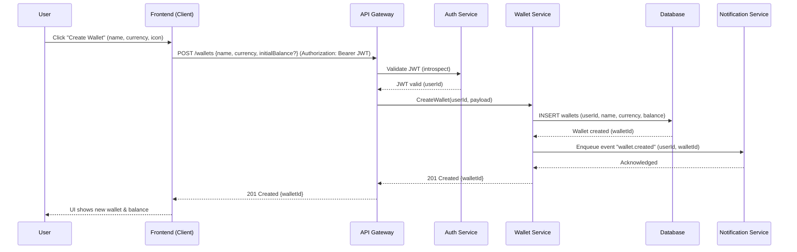
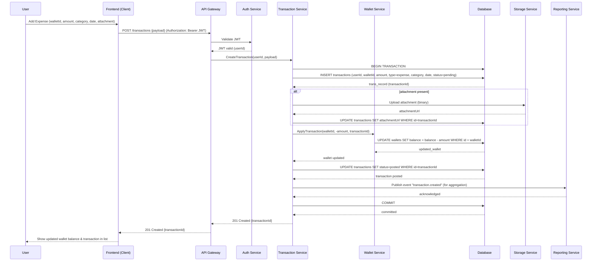
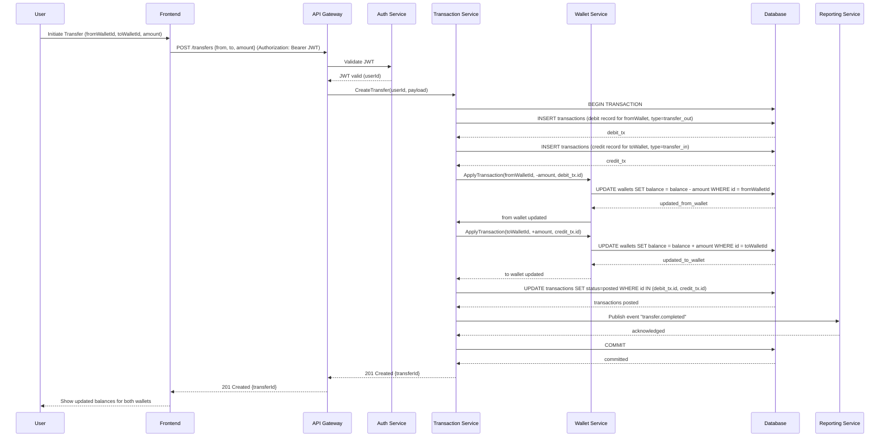
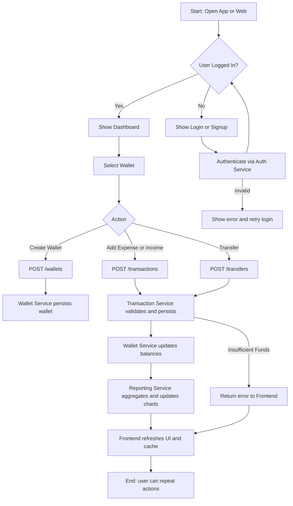

# Expense Tracker App

**Document:** Sequence Diagrams & Flowcharts (Mermaid)

**Language:** English

**Purpose:** This document contains UML sequence diagrams and flowcharts written in Mermaid syntax to describe the main flows of the Expense Tracker App. Use these diagrams directly in markdown-capable renderers (e.g., GitHub, GitLab, MkDocs with Mermaid plugin) or paste into Mermaid live editors.

---

## Table of Contents

1. Overview
2. Legend / Components
3. Sequence Diagram — Create Wallet
4. Sequence Diagram — Add Expense (including attachment)
5. Sequence Diagram — Transfer Between Wallets
6. Flowchart — High-level Application Flow
7. Notes & Integration Tips

---

## 1. Overview

This document provides three main sequence diagrams and a high-level flowchart to illustrate how the Expense Tracker App works end-to-end. Diagrams are written in Mermaid syntax so they can be rendered in any Mermaid-capable Markdown renderer.

---

## 2. Legend / Components

* **User** — mobile/web user interacting with frontend.
* **Frontend (Client)** — SPA or native client that calls backend APIs.
* **Auth Service** — handles signup, login, issuing JWTs.
* **API Gateway** — (optional) entry point for routing/ rate-limiting.
* **Wallet Service** — manages wallet resources and balances.
* **Transaction Service** — creates, edits, deletes transactions; enforces business rules and idempotency.
* **Reporting Service** — aggregates data for analytics and charts.
* **Notification Service** — sends emails / push notifications.
* **Database** — persistent storage (wallets, transactions, users, categories).

---

## 3. Sequence Diagram — Create Wallet

**Explanation:**

* Authentication is validated by the Auth Service (could be done inside API Gateway).
* Wallet creation persists to DB and may emit events (for audit, metrics, or notifications).

---

## 4. Sequence Diagram — Add Expense (with attachment)

**Notes:**

* All balance updates happen in the Wallet Service under DB transaction to keep consistency.
* Storage Service (SS) could be S3 or other object store; attachments are uploaded and referenced.
* Transaction Service emits events for reporting and eventual consistency where needed.

---

## 5. Sequence Diagram — Transfer Between Wallets

**Key points:**

* Transfer is implemented as two transactions (debit + credit) within a single DB transaction to maintain consistency and atomicity.
* Use idempotency keys to avoid double-processing if the client retries.

---

## 6. Flowchart — High-level Application Flow

**Flowchart description:**

* This high-level flowchart shows the main user choices and the backend services involved.
* Error paths (like authentication failure or insufficient funds) are visualized.

---

## 7. Notes & Integration Tips

* **Idempotency:** For endpoints that change balances (transfers & transaction creation), require an idempotency key from the client. Store the key and response to avoid double-processing.
* **ACID guarantees:** Use DB transactions for multi-step updates (transfer) to keep data consistent.
* **Eventing:** Emit domain events (e.g., `transaction.created`, `wallet.created`) for reporting, notifications, and external integrations. Consider a message broker (Kafka/RabbitMQ/SQS).
* **Storage attachments:** Upload attachments directly from client to signed URLs (S3 pre-signed) to avoid passing binary through backend if you prefer scale.
* **Testing:** Add integration tests for the transactional flows (transfer, edit, delete) and concurrency tests for simultaneous transactions on same wallet.
* **Monitoring:** Track metrics like balance drift, failed transactions, and event lag.

---

### Ready-to-use Mermaid blocks

You can copy & paste the mermaid code blocks from above into your markdown files or renderers. Example renderers: GitHub (with mermaid enabled), GitLab, Mermaid Live Editor, or static site generators with Mermaid plugin.

---

If you'd like, I can:

* Add a separate sequence diagram per microservice (internal calls) with more detail.
* Produce a PNG/SVG export of each diagram.
* Convert flowchart into PlantUML or draw.io format.

Tell me which next step you want.
