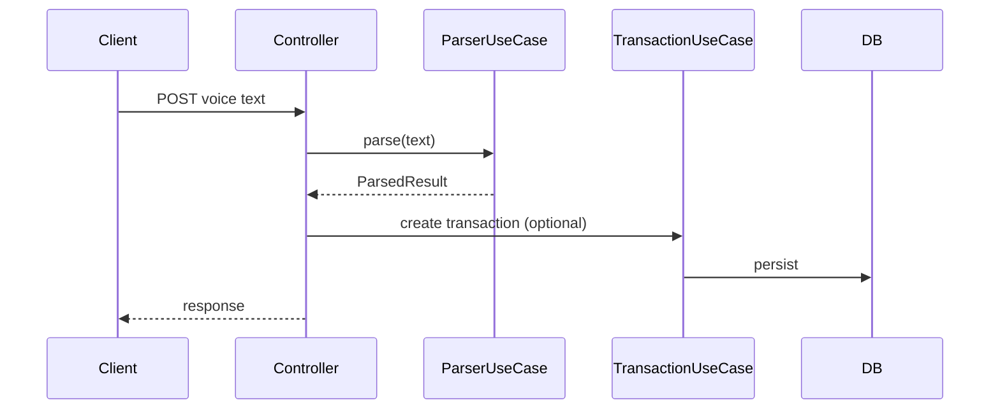

````md
# Voice Expense Backend – MVP Implementation

## Purpose
This document defines the backend implementation for the **Voice Expense MVP**.
The **core value of this feature is the backend parsing UseCase**, not the UI.

The backend is responsible for:
- Parsing natural language text (Bahasa Indonesia)
- Extracting structured transaction data
- Handling ambiguity and validation
- Returning a safe, confirmable result

Frontend is treated as a thin client.

---

## Design Principle (IMPORTANT)

> **Backend Parser UseCase First**

Implementation order MUST be:
1. Text parsing engine
2. Parsing accuracy & fallback handling
3. API contract stability
4. Transaction persistence
5. Frontend integration

UI MUST adapt to parser limitations — not the opposite.

---

## Tech Stack
- Java 21+
- Spring Boot
- Spring Security (JWT)
- JPA / Hibernate
- PostgreSQL
- JUnit 5

---

## API Contract

### POST `/api/voice-expense`

#### Request
```json
{
  "text": "beli kopi dua puluh lima ribu pakai gopay"
}
````

#### Response (Success)

```json
{
  "status": "SUCCESS",
  "confidence": "HIGH",
  "parsed": {
    "amount": 25000,
    "categoryId": "uuid",
    "walletId": "uuid",
    "date": "2025-12-18",
    "type": "EXPENSE"
  }
}
```

#### Response (Need Confirmation)

```json
{
  "status": "NEEDS_CONFIRMATION",
  "confidence": "LOW",
  "parsed": {
    "amount": 25000,
    "categoryId": null,
    "walletId": null
  },
  "missingFields": ["CATEGORY", "WALLET"]
}
```

#### Response (Error)

```json
{
  "status": "FAILED",
  "reason": "AMOUNT_NOT_DETECTED"
}
```

---

## High-Level Flow



---

## Core Component Overview

```
voice/
├── controller/
│   ├── VoiceExpenseController.java
│   └── KeywordSettingsController.java
├── dto/
│   ├── VoiceExpenseRequestDto.java
│   ├── VoiceExpenseResponseDto.java
│   ├── CreateKeywordRequestDto.java
│   └── KeywordResponseDto.java
├── domain/
│   ├── KeywordMapping.java
│   └── KeywordType.java
├── usecase/
│   ├── ParseVoiceExpenseUseCase.java          ⭐
│   ├── CreateKeywordMappingUseCase.java
│   ├── UpdateKeywordMappingUseCase.java
│   ├── DeleteKeywordMappingUseCase.java
│   ├── ListKeywordMappingUseCase.java
│   └── LoadKeywordMappingHandler.java
├── parse/
│   ├── AmountParser.java
│   ├── CategoryMatcher.java
│   ├── WalletMatcher.java
│   ├── ParseVoiceExpenseResult.java
│   └── ParsingConfidence.java
├── port/
│   ├── KeywordMappingQueryPort.java
│   └── KeywordMappingCommandPort.java
└── infrastructure/
    ├── persistence/
    │   ├── KeywordMappingEntity.java
    │   ├── KeywordMappingRepository.java
    │   └── JpaKeywordMappingAdapter.java
    └── cache/
        └── CachedKeywordMappingQueryPort.java

```

---

## Core UseCase: VoiceExpenseParserUseCase

### Responsibility

* Accept raw text
* Coordinate parsing steps
* Decide confidence level
* NEVER access database directly

### Interface

```java
public interface VoiceExpenseParserUseCase {
    ParsingResult parse(String rawText, UUID userId);
}
```

---

## Step 1 – Text Normalization

### Rules

* Lowercase
* Remove punctuation
* Trim extra spaces

```java
String normalized = rawText
    .toLowerCase()
    .replaceAll("[^a-z0-9 ]", " ")
    .replaceAll("\\s+", " ")
    .trim();
```

---

## Step 2 – Amount Parsing (CRITICAL)

### Supported Formats (MVP)

✅ `25000`
✅ `dua puluh lima ribu`
✅ `lima puluh ribu`

❌ Decimal
❌ Juta
❌ Kombinasi kompleks

---

### Word-to-Number Mapping

```java
Map<String, Integer> basicNumbers = Map.of(
    "nol", 0,
    "satu", 1,
    "dua", 2,
    "tiga", 3,
    "empat", 4,
    "lima", 5,
    "enam", 6,
    "tujuh", 7,
    "delapan", 8,
    "sembilan", 9,
    "sepuluh", 10
);
```

### Multiplier Keywords

* `puluh` → x10
* `ratus` → x100
* `ribu` → x1000

### Rule

> If amount is NOT detected → **STOP parsing and return FAILED**

---

## Step 3 – Category Matching

### Strategy

* Dictionary-based keyword matching
* Match against user-owned categories
* Add to database for this mapping
* user can add/edit keywords later on settings (future)

### Example Mapping

| Keyword | Category  |
| ------- | --------- |
| kopi    | FOOD      |
| makan   | FOOD      |
| bensin  | TRANSPORT |
| parkir  | TRANSPORT |
| pulsa   | PHONE     |

### Rule

* First match wins
* If no match → category is NULL / input as others category (needs confirmation from user)

---

## Step 4 – Wallet Matching

### Strategy

* Keyword matching against wallet names
* Aliases supported (e.g. "cash", "tunai")

### Fallback Rule

> If wallet not mentioned → use user's default wallet
> need to add field on wallet entity for default flag

---

## Step 5 – Build ParsingResult

```java
ParsingResult result = ParsingResult.builder()
    .amount(amount)
    .categoryId(categoryId)
    .walletId(walletId)
    .type(EXPENSE)
    .date(LocalDate.now())
    .confidence(calculateConfidence())
    .build();
```

---

## Confidence Calculation

| Condition                  | Confidence |
| -------------------------- | ---------- |
| Amount + Category + Wallet | HIGH       |
| Amount only                | MEDIUM     |
| Amount missing             | FAILED     |

Confidence determines frontend behavior.

---

## Transaction Creation Strategy

> Parser DOES NOT save data.

Controller decides:

* Auto-save if confidence = HIGH
* Ask confirmation if MEDIUM / LOW

---

## Security Rules

* Endpoint requires authentication
* Validate category & wallet ownership
* Never trust frontend-confirmed IDs

---

## Error Codes

| Code                | Description            |
| ------------------- | ---------------------- |
| AMOUNT_NOT_DETECTED | Cannot parse amount    |
| INVALID_TEXT        | Empty or invalid input |
| UNAUTHORIZED        | No auth context        |

---

## Testing Strategy (MANDATORY)

### Unit Tests

* Amount parsing
* Keyword detection
* Confidence calculation

### Sample Test Case

```java
@Test
void shouldParseAmountFromWords() {
    ParsingResult result = parser.parse(
        "beli kopi dua puluh lima ribu",
        userId
    );

    assertEquals(25000, result.amount());
}
```

---

## MVP Completion Checklist

### Core Parser (BLOCKER)

* [ ] Amount parser implemented
* [ ] Category matcher implemented
* [ ] Wallet matcher implemented
* [ ] Confidence logic implemented
* [ ] Unit tests ≥ 80% coverage

### API

* [ ] Endpoint secured
* [ ] Error response standardized

### Persistence

* [ ] Transaction creation separated from parsing

---

## Future Upgrade Path

* Replace rule engine with LLM
* Keep `ParsingResult` contract unchanged
* Add confidence score (0–100)
